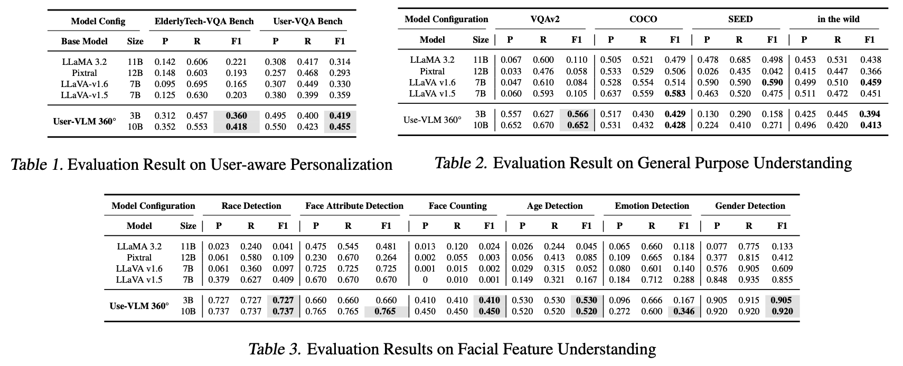

# User-VLM 360°

## Personalized Vision Language Models with User-aware Tuning for Social Human-Robot Interactions


### Authors  
- [Hamed Rahimi](https://www.hamedrahimi.fr) (ISIR, Sorbonne University)  
- [Adil Bahaj](https://scholar.google.com/citations?user=sMZJfr0AAAAJ&hl=fr) (International University of Rabat)  
- [Mouad Abrini](https://www.isir.upmc.fr/personnel/mouad-abrini/) (ISIR, Sorbonne University)  
- [Mahdi Khoramshahi](https://www.isir.upmc.fr/personnel/khoramshahi/?lang=en) (ISIR, Sorbonne University)  
- [Mounir Ghogho](https://scholar.google.com/citations?user=aIXHNpAAAAAJ&hl=en) (International University of Rabat)  
- [Mohamed Chetouani](https://www.isir.upmc.fr/personnel/chetouani/) (ISIR, Sorbonne University)  

## Overview  
User-VLM 360° is a personalized vision-language model that enhances human-robot interaction by integrating user-aware tuning and bias-aware optimization. It adapts in real-time using multimodal signals and mitigates bias through preference optimization. The framework is validated across multiple benchmarks and real-world deployment on the Pepper robot.

## Features  
- **User-aware Tuning**: Real-time adaptation of interactions using visual-linguistic signals.  
- **Bias Mitigation**: Ethical and fair optimization of user personalization.  
- **360° Socio-Emotive Interaction Dataset**: Annotated with demographic, emotion, and relational metadata.  
- **State-of-the-Art Performance**: Achieves up to **+35.3% F1 in personalized VQA** and **+47.5% F1 in facial feature understanding**, with a **15% bias reduction** and **30× speedup over baselines**.  

## Deployment on Pepper  


## Results  
### Personalized Performance  
  
User-VLM 360° outperforms baseline models in user-aware personalization, facial feature understanding, and multimodal reasoning. It achieves up to a **2x improvement in ROUGE-1 F1 scores** over baselines in user-centric VQA tasks.

### Fairness Optimization  
  
User-VLM 360° enhances fairness, improving ROUGE-1 and BERTScore while mitigating bias through DPO tuning.

### Computational Efficiency  
  
User-VLM 360° achieves up to a **30× reduction in FLOPs**, significantly improving computational efficiency without compromising performance.

## Resources  
- **[📂 Code](https://github.com/hamedR96/User-VLM)**  
- **[🤖 Models](https://huggingface.co/ACIDE/User-VLM-10B-Instruct)**  
- **[📊 Dataset](https://huggingface.co/ACIDE)**  
- **[📄 Paper (arXiv)](https://arxiv.org/abs/<ARXIV_PAPER_ID>)**  

---
### Citation  
If you use User-VLM 360° in your research, please cite:  
```bibtex
@article{rahimi2025uservlm,
  author    = {Hamed Rahimi and Adil Bahaj and Mouad Abrini and Mahdi Khoramshahi and Mounir Ghogho and Mohamed Chetouani},
  title     = {User-VLM 360°: Personalized Vision Language Models with User-aware Tuning for Social Human-Robot Interactions},
  journal   = {arXiv preprint arXiv:<ARXIV_PAPER_ID>},
  year      = {2025}
}
```
---
### Acknowledgment
The authors would like to express their sincere appreciation to the euROBIN – European ROBotics and AI Network project (Horizon Europe Grant Agreement No 101070596) for its invaluable contributions to advancing research and collaboration in robotics and artificial intelligence. The project’s vision of fostering knowledge sharing, interoperability, and human-centric robotics across Europe has provided significant inspiration and context for this work. We gratefully acknowledge the efforts of all euROBIN partners in building a unified European ecosystem for robotics research and innovation.
